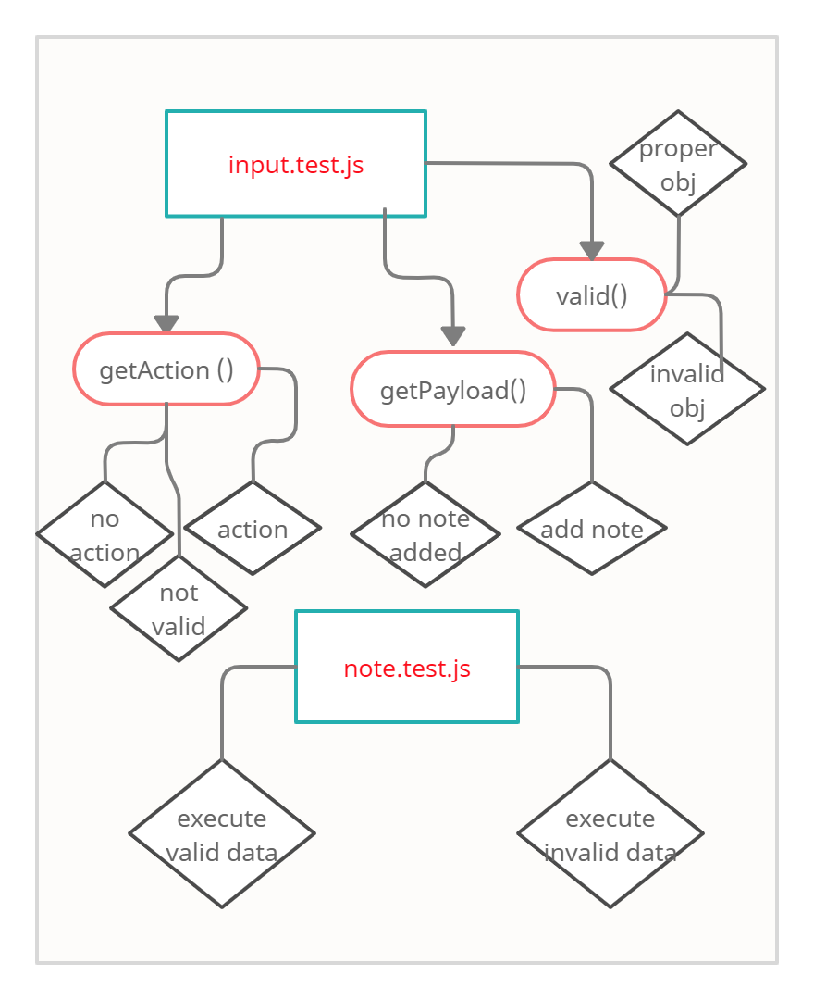

# Lab - 01 
 
 ### Node Ecosystem.. 

 #### Author : Hanaa Al-Ghazzi 

**Link and Resources** : 
 (pull request)[https://github.com/HanaaGhazzi/notes/pull/1] . 

 ### Modules:
```
Node.js
```
### Packages : 

``` 
minimist
uuid 
```
### How to Initialize/Run your application?

- ```node index.js --add "your note" ```
- ```node index.js -a "your note" ```
- ```./index.js --add "your note" ```
- ```./index.js -a"your note" ```

### Tests : 

- Jest : ```npm test``` 

### UML : 



